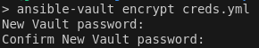
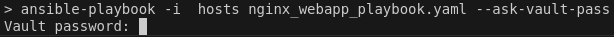
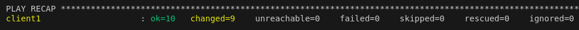

### How to deploy your stacker platform ?

---

**First set the variables with the correct values.**
Put your servers IPs or DNS name in host_vars/client1.yml and host_vars/client2.yml
Then complete the creds.yml file with the username and passwords of your sudoer user on the servers.
And finally, encrypt this file with the 'ansible-vault' command.

`ansible-vault encrypt creds.yml`

You will have to type a password.

Now, you're all set to run the playbook.

Execute the 'ansible-playbook' command to deploy the platform.

`ansible-playbook -i hosts nginx_webapp_playbook.yaml --ask-vault-pass`

You will be ask for the password set earlier.

Then, you shoud end up with something like this :

Enjoy!

